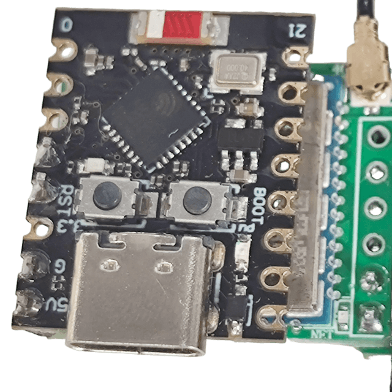

# 低成本短信转发器

> 当前分支为新方案，老方案请前往[luatos分支](https://github.com/chenxuuu/sms_forwarding/tree/old-luatos)。
该项目可能不支持电信卡（CDMA），具体请自测。

本项目旨在使用低成本的硬件设备，实现短信的自动转发功能，发送到指定的HTTP或邮箱。



## 硬件搭配

- ESP32C3开发板，当前选用[ESP32C3 Super Mini](https://item.taobao.com/item.htm?id=852057780489&skuId=5813710390565)，¥9.5包邮
- ML307R-DC开发板，当前选用[小蓝鲸ML307R-DC核心板](https://item.taobao.com/item.htm?id=797466121802&skuId=5722077108045)，¥16.3包邮
- [4G FPC天线](https://item.taobao.com/item.htm?id=797466121802&skuId=5722077108045)，¥2，与核心板同购

当前成本约¥27.8

## 硬件连接

ESP32C3 与 ML307R-DC 通过串口（UART）连接，接线如下：

```
ESP32C3 Super Mini          ML307R-DC核心板
┌─────────────────┐         ┌─────────────────┐
│                 │         │                 │
│  GPIO3 (TX) ────┼────────►│ RX              │
│                 │         │                 │
│  GPIO4 (RX) ◄───┼─────────┤ TX              │
│                 │         │                 │
│  GND ───────────┼─────────┤ GND             │
│                 │         │                 │
│  5V ────────────┼─────────┤ VCC (5V)        │
│                 │         │                 │
└─────────────────┘         └─────────────────┘
                            │                 │
                            │  SIM卡槽        │
                            │  (插入Nano SIM) │
                            │                 │
                            │  天线接口       │
                            │  (连接4G天线)   │
                            └─────────────────┘
```

可通过USB连接ESP32C3进行编程和供电，正常工作时，ESP32C3的虚拟串口数据将直接被转发到ML307R-DC，方便调试。

## 软件组成

- ESP32C3运行自己的`Arduino`固件，负责连接WiFi和接收ML307R-DC发送过来的短信数据，然后转发到指定HTTP接口或邮箱
- ML307R-DC运行默认的AT固件，不用动

需要在`Arduino IDE`中单独安装这些库：

- **ReadyMail** by Mobizt
- **pdulib** by David Henry

需要在`Arduino IDE`中安装ESP32开发板支持，参考[官方文档](https://docs.espressif.com/projects/arduino-esp32/en/latest/installing.html)，版型选`MakerGO ESP32 C3 SuperMini`。
