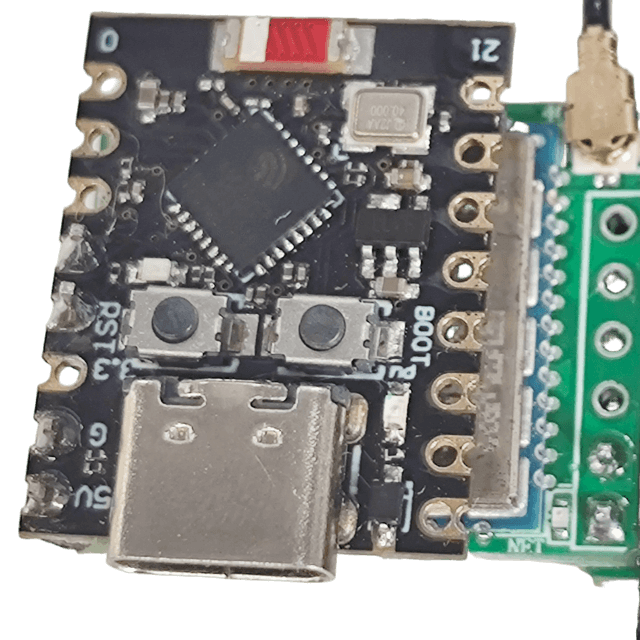
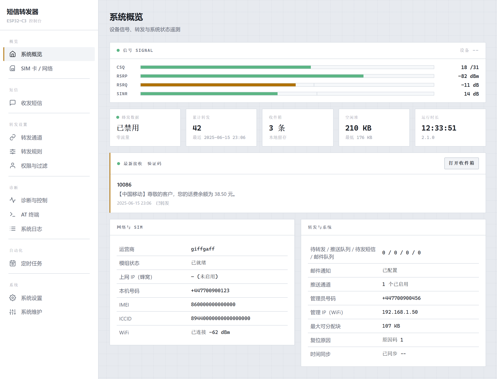
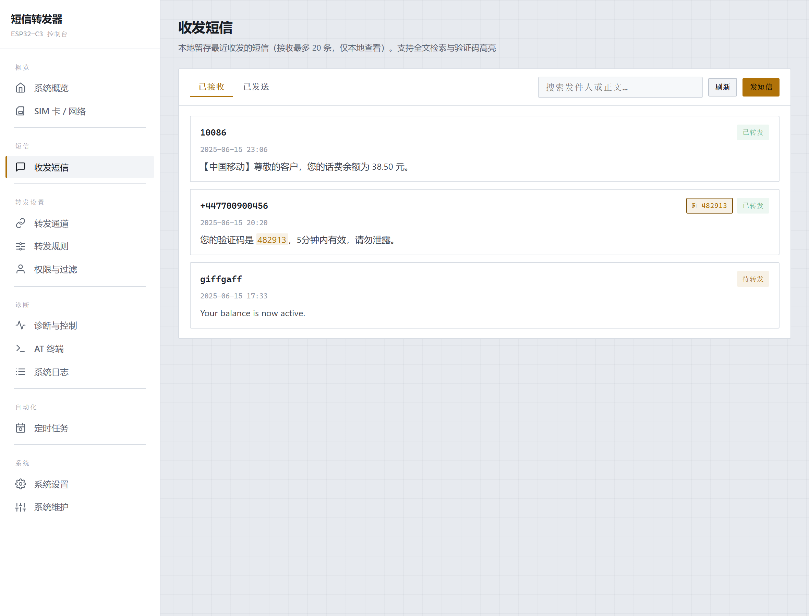
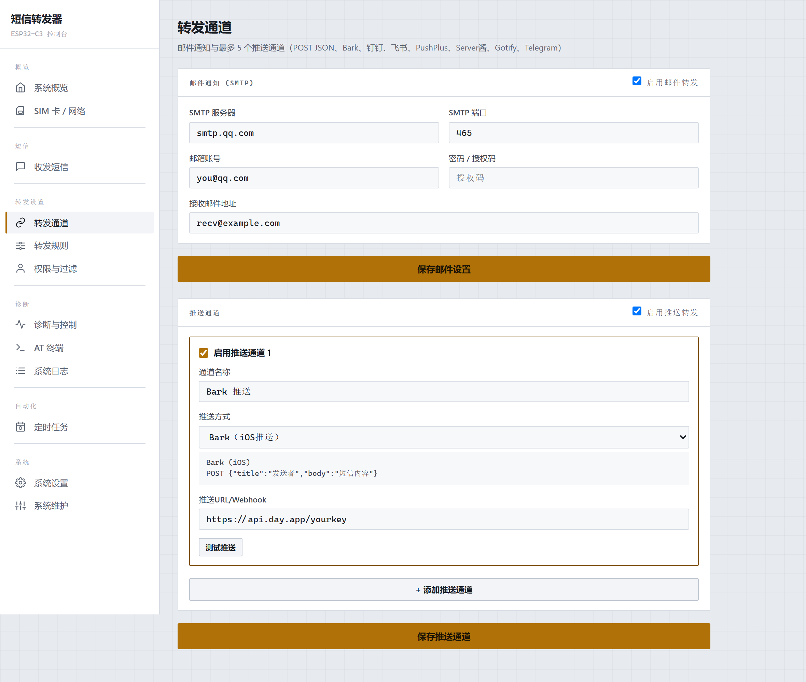
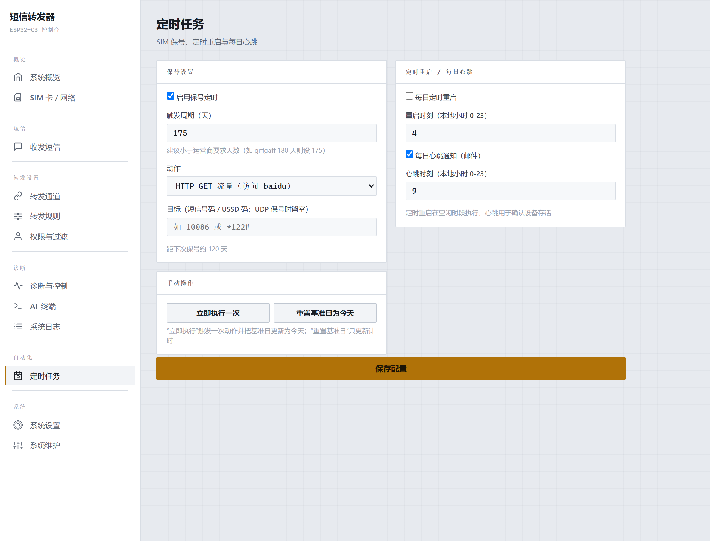
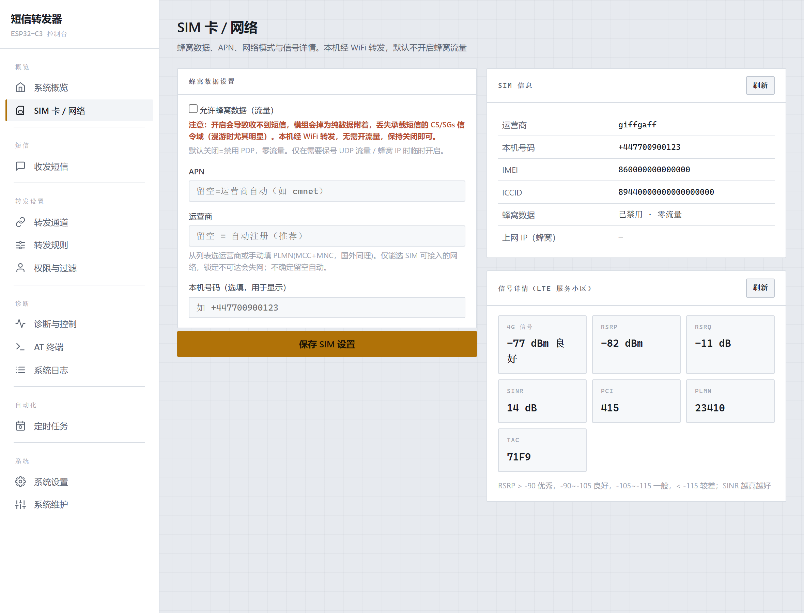
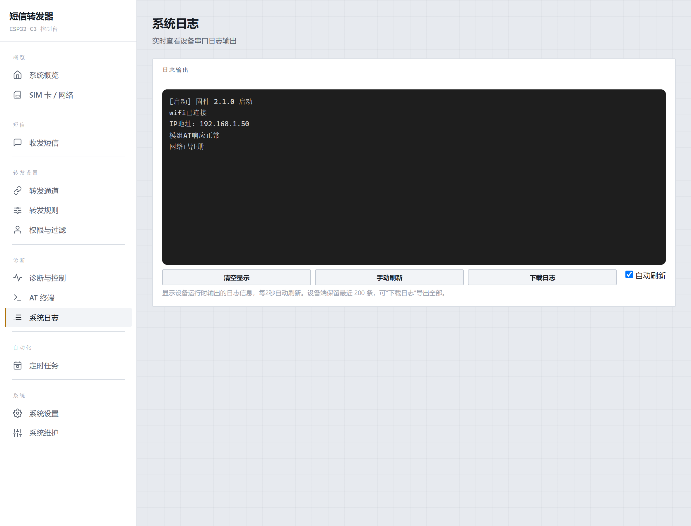

# 低成本短信转发器（ESP32-C3 + 4G 模组）

> 基于 [chenxuuu/sms_forwarding](https://github.com/chenxuuu/sms_forwarding) 的新方案重构与优化。2022 年的老方案请见 [luatos 分支](https://github.com/chenxuuu/sms_forwarding/tree/old-luatos)。

用一套约 ¥28 的硬件，把 4G SIM 卡收到的短信**自动转发到邮箱 + 最多 5 个推送通道**（Bark / Telegram / 钉钉 / 飞书 / Server酱 / PushPlus / Gotify / 自定义…），并提供一个网页控制台做配置、查看与诊断。同时内置**自动保号**，适合给 giffgaff、物联网卡、副卡等“只用来收验证码 / 需要定期动账保号”的号码长期值守。

> ⚠️ **测试版固件**：本分支为重构 / 优化的新方案，仍在持续验证中，请先小范围试用、确认稳定后再长期值守。其中**「保号定时任务」（蜂窝 UDP 流量 / 发短信 / USSD）为实验性功能**——不同运营商、不同卡对“动账 / 保号”的判定差异很大，**请务必自行确认保号是否真的生效**（如查看运营商 App 的用量或最后活跃日期）。遇到任何问题（收不到短信、转发 / 推送失败、保号无效、崩溃重启等），欢迎及时[提交 issue](https://github.com/MineSunshineone/sms_forwarding/issues)。

> **设计边界（不会支持）**：本项目**仅用于接收短信**与保号。多卡控制、通话、拨号、对外开放 API、自动化编排等**永远不在计划内**，请勿提需求。

- 在线演示（上游）：<https://sms.j2.cx/> ｜ 视频教程（上游）：[B 站](https://www.bilibili.com/video/BV1cSmABYEiX)



---

## 界面预览

网页控制台为单页应用（SPA，直接从 flash 流式输出，无需联网加载任何外部资源），“场测仪 / 纸面仪器”风格，等宽数据 + 信号阈值读数。所有页面均受 HTTP Basic Auth 保护。

### 系统概览
一屏看全：4G 信号（CSQ / RSRP / RSRQ / SINR 量表）、转发统计、空闲堆水位、队列深度、运营商 / IMEI / ICCID、运行时长与复位原因。



### 收发短信（验证码自动高亮 + 一键复制）
本地留存最近短信，**自动识别验证码并高亮**、一键复制；支持全文检索、已接收 / 已发送分栏、单条重发。



### 转发通道（邮件 + 多推送）
| 转发通道配置 | 保号 / 定时任务 |
|---|---|
|  |  |

### SIM / 网络 与 系统日志
| SIM 卡 / 网络（信号详情） | 实时系统日志 |
|---|---|
|  |  |

---

## 主要功能

- **多通道转发**：邮件（SMTP）+ 最多 **5 个推送通道**同时启用，每个通道独立配置（见下表 10 种推送方式）。
- **真·异步不阻塞**：推送（HTTP/HTTPS）与邮件（SMTP）由**独立后台任务**发送，慢速 TLS/SMTP **不会卡住收短信、也不会卡住网页刷新**；接收与转发解耦，突发短信平滑入队。
- **自动保号（绝对日期，断电不忘）｜🧪 实验性**：按设定周期（如 giffgaff 每 180 天）自动维持 SIM 活跃，基准日持久化于 NVS，断电重启对时后仍准确。动作可选 **蜂窝 UDP 流量（约 48KB 上行）/ 发短信 / USSD 查询**。⚠️ 各运营商动账判定不同，请自行确认保号确实生效。
- **开机补收**：自动读取并转发断电期间暂存于 SIM 的短信，转发后按索引清理释放存储。
- **长短信自动合并**：按最近分段计时合并多段长短信，避免负载抖动误超时。
- **转发规则**：按发件人 / 关键词匹配，决定发往哪些通道、是否发邮件、或直接丢弃（支持轻量正则）。
- **弱网更稳**：推送失败 / 断网进入有界重试队列（指数退避）；WiFi 自动重连；模组健康自动探测，连续无响应自动断电重启恢复。
- **接收双保险**：默认 `+CMTI` 存储通知，优先按索引 `AT+CMGR` 读取单条短信；60s `AT+CMGL` 兜底轮询并重申 CNMI，短信先落 SIM/MT 存储再解析转发；兼容 `+CMT` 直推路径，fnv1a 去重让双路径幂等安全。
- **管理员短信**：授权号码可短信远程触发发短信 / 重启（含防重启风暴与入参校验）。
- **可观测 & 自愈**：`/status` 健康 JSON（堆水位 / 信号 / 队列深度 / 统计 / 复位原因）、低堆有序自重启、mDNS（`http://sms.local`）。
- **隐私**：网页日志中短信正文与号码默认脱敏（仅记字节数与脱敏号码）。
- **配网友好**：未配置 / 连不上 WiFi 时自动开启配网热点（强制门户），手机连上即可在网页里填 WiFi。
- **网页省占用**：配置页从 flash 分块流式输出 + ETag/304，避免整页堆拷贝；日志增量轮询（`?since=` 游标）。
- 通道一键测试推送、USSD 余额查询、网页发短信（消耗余额）、配置导入导出、网页 OTA 升级。

## 推送通道支持

可同时启用多个，共 **10 种**推送方式：

| 推送方式 | 说明 | 需要配置 |
|---|---|---|
| **POST JSON** | 通用 HTTP POST | URL |
| **Bark** | iOS 推送 | Bark 服务器 URL |
| **GET 请求** | 参数放 URL | URL |
| **钉钉机器人** | 企业群通知 | Webhook URL，可选 Secret 加签 |
| **PushPlus** | 微信公众号推送 | Token |
| **Server酱** | 微信推送 | SendKey |
| **自定义模板** | 灵活 JSON 模板 | URL + 请求体模板 |
| **飞书机器人** | 自定义群通知 | Webhook URL，可选 Secret 加签 |
| **Gotify** | 自建推送服务 | URL + Token |
| **Telegram Bot** | Telegram 推送 | Chat ID + Bot Token（可选自建 API 域名） |

格式约定：

- **POST JSON**：`{"sender":"发送者","message":"内容","timestamp":"时间"}`
- **Bark**：`{"title":"发送者","body":"内容"}`
- **GET**：`URL?sender=..&message=..&timestamp=..`（自动 URL 编码）
- **自定义模板**：用 `{sender}` / `{message}` / `{timestamp}` 占位符
- 钉钉 / 飞书支持 HMAC-SHA256 加签；Server酱支持 Markdown；PushPlus 支持 HTML

---

## 硬件搭配

**方案一：买成品**（成本与自制相当，免焊接），支持**移动 / 联通 / 电信卡**：

- [小蓝鲸 WIFI 短信宝](https://item.taobao.com/item.htm?id=1003711355912)（找客服）+ [4G FPC 天线](https://item.taobao.com/item.htm?id=1003711355912&skuId=6162872574943)

**方案二：自行焊接**，总成本约 ¥27.8（支持**移动 / 联通卡**）：

- ESP32-C3 开发板：[ESP32C3 Super Mini](https://item.taobao.com/item.htm?id=852057780489&skuId=5813710390565)，¥9.5
- 4G 模组核心板：[小蓝鲸 ML307R-DC 核心板](https://item.taobao.com/item.htm?id=797466121802&skuId=5722077108045)，¥16.3
- [4G FPC 天线](https://item.taobao.com/item.htm?id=797466121802&skuId=5722077108045)，¥2

> **模组兼容性**：整个 **ML307 系列**（ML307R / ML307C / ML307A 及各 “DC” 变体）共用同一套中移 AT 命令集，PDU 短信 / CNMI / CMGL / CMGS / CEREG / CUSD / MIPOPEN 等均通用，可直接替换。请用模组的 **UART 焊盘**（不是 USB 口）连接，并把 EN/电源脚接到 GPIO5 以支持硬件断电恢复。

### 接线（UART）

```
   ESP32C3 Super Mini        ML307x-DC 核心板
 ┌───────────────────┐    ┌─────────────────┐
 │   GPIO5 (MODEM_EN) ┼───►│ EN              │
 │       GPIO3 (TX) ──┼───►│ RX              │
 │       GPIO4 (RX) ◄─┼────┤ TX              │
 │              GND ──┼────┤ GND             │
 │               5V ──┼────┤ VCC (5V)        │
 └───────────────────┘    │  SIM 卡槽 (Nano) │
                          │  4G 天线接口      │
                          └─────────────────┘
```

引脚定义在 `code/globals.h`（`TXD=GPIO3, RXD=GPIO4, MODEM_EN=GPIO5, LED=GPIO8`）。用 USB 连 ESP32-C3 即可供电 + 编程 + 串口调试。

---

## 快速编译 / 烧录

固件含 OTA + TLS + SMTP，体积约 1.48MB，**超过默认分区的 1.31MB APP 上限**，必须改用 **`min_spiffs`（1.9MB APP，保留 OTA）** 分区，否则会报 “Sketch too big” 烧不进去。

### 准备

1. **创建 `code/wifi_config.h`**（已被 `.gitignore`，存放明文凭据，切勿提交）。
   > 💡 **省事提示**：如果你不想烧录后还要手动连接设备的配网热点、再在网页里填 WiFi，可以**在烧录前就在这里填好设备能连上的 WiFi**，开机即自动联网：
   ```cpp
   #define WIFI_SSID "你的WiFi"
   #define WIFI_PASS "你的密码"
   ```
   也可以**留空**走纯网页配网（仍须定义这两个宏以便编译）——开机连不上就自动开配网热点让你在手机上配：
   ```cpp
   #define WIFI_SSID ""
   #define WIFI_PASS ""
   ```
2. WiFi 凭据优先级：**NVS（网页里配过）→ `wifi_config.h` 宏 → 都为空 / 连不上则进配网热点**。也就是说 `wifi_config.h` 只是“出厂默认 / 兜底”，之后随时能在网页「WiFi 设置」里改并持久化到 NVS。

### 方式 A：arduino-cli（推荐，可复制粘贴）

```bash
# 1) 装核心与库（一次性）
arduino-cli core install esp32:esp32
arduino-cli lib install pdulib ReadyMail

# 2) 编译（关键：min_spiffs 分区）
arduino-cli compile \
  --fqbn esp32:esp32:esp32c3:PartitionScheme=min_spiffs,CDCOnBoot=cdc \
  --build-path build code

# 3) 烧录（把 COM5 换成你的端口）
arduino-cli upload \
  --fqbn esp32:esp32:esp32c3:PartitionScheme=min_spiffs,CDCOnBoot=cdc \
  --port COM5 --input-dir build code

# 4) 看日志
arduino-cli monitor --port COM5 --config 115200
```

> 若坚持用 `makergo_c3_supermini` 板型（其菜单没有 min_spiffs 选项），改用属性覆盖：
> ```bash
> arduino-cli compile --fqbn esp32:esp32:makergo_c3_supermini \
>   --build-property build.partitions=min_spiffs \
>   --build-property upload.maximum_size=1966080 \
>   --build-path build code
> ```
> 路径请保持**纯 ASCII**（中文路径会导致编译失败）。

### 方式 B：Arduino IDE

1. 安装 [ESP32 开发板支持](https://docs.espressif.com/projects/arduino-esp32/en/latest/installing.html)（core 3.x），库管理器装 **ReadyMail**（by Mobizt）与 **pdulib**（by David Henry）。
2. 板型选 **ESP32C3 Dev Module** → 工具 → **Partition Scheme = `Minimal SPIFFS (1.9MB APP with OTA)`** → **USB CDC On Boot = Enabled**。
3. 编译上传。

> **首次烧录排障**：串口反复“断开 / 接入”、刷屏 `invalid header: 0xffffffff` 是空 flash 引导循环，烧入固件即恢复。若烧不进，进下载模式：**按住 BOOT → 点一下 RESET → 松开 BOOT**，再上传。

### 首次使用

1. 上电后看串口或路由器拿到设备 IP，浏览器访问（或 `http://sms.local`）。
2. 默认账号密码 **`admin` / `admin123`**，**请立即在“系统设置”里改掉**。
3. 在“转发通道”配好邮件 / 推送，可点“测试推送”当场验证；按需在“定时任务”里开保号。

---

## 架构与开发文档

固件为 **Arduino loop 任务 + 一个推送/邮件后台任务**双线程：网页服务、模组 AT、短信收发、保号都在 loop 上；只有慢速的推送/邮件 TLS 发送放到后台任务，从而做到收短信与网页都不被阻塞。源码全部在 `code/`（单 Arduino sketch），注释为中文。

- 主机单元测试（纯逻辑，g++，无需硬件）：`test/run.ps1` 或 `test/run.sh`
- 详细文档见 [`dev_doc/`](dev_doc/)：[架构与数据流](dev_doc/architecture.md) ｜ [逐文件模块说明](dev_doc/module_details.md) ｜ [HTTP / AT 接口参考](dev_doc/api_reference.md)
- 给 AI 助手的工程约定见 [`CLAUDE.md`](CLAUDE.md) / [`AGENTS.md`](AGENTS.md)

## 隐私与安全

- 所有网页路由均需 Basic Auth；首次务必修改默认密码。
- 网页可见日志默认对短信正文与号码脱敏（编译期 `-DSMS_LOG_VERBOSE=1` 才输出完整内容，仅用于本地调试）。
- 默认**不开启蜂窝数据**（PDP 关闭，零计费流量）；保号动作才会临时激活数据、产生一次真实流量后关闭。本机转发一律走 **WiFi**，不消耗蜂窝流量。
