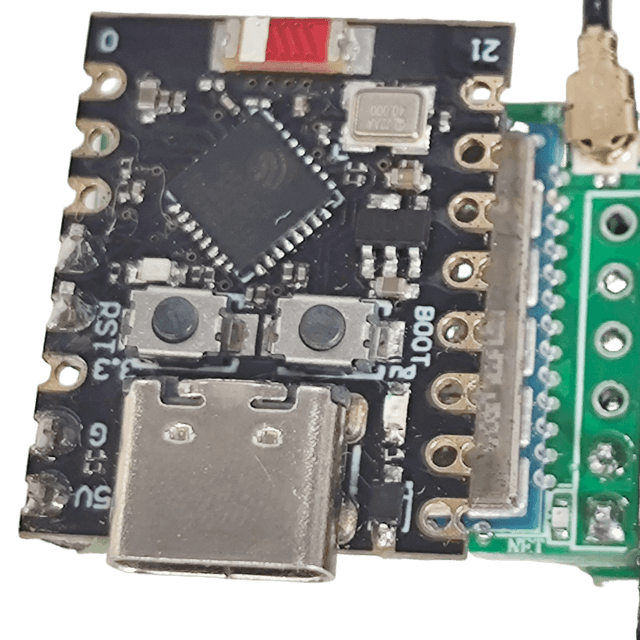
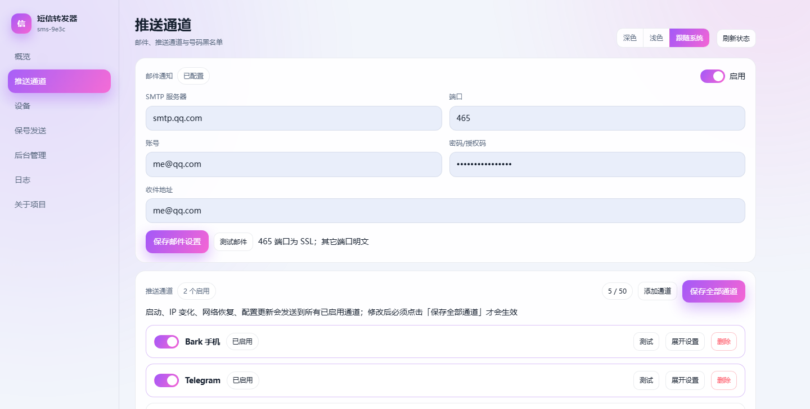

<div align="center">



# 低成本短信转发器

**一张 4G 卡（实体 SIM 或 eSIM）+ 一块 ESP32-C3，把收到的短信在几秒内推到邮件、钉钉、飞书、微信、Telegram**

[](LICENSE)
[](idf/)
[](#硬件)
[](../../actions/workflows/firmware.yml)
[](../../releases/latest)
[](https://sms.j2.cx/)

[在线演示](https://sms.j2.cx/) · [硬件采购](#硬件) · [烧录](#烧录) · [视频教程](https://www.bilibili.com/video/BV1cSmABYEiX) · [常见问题](#常见问题)

</div>



> **老方案在哪**：[`old-luatos` 分支](https://github.com/chenxuuu/sms_forwarding/tree/old-luatos)、[`code/`](code/)（[Arduino 框架版](code/README.md)）  
> 当前主线是 [`idf/`](idf/)。
>
> **免责声明**：本项目仅供个人学习与自用。请遵守所在地法律法规、运营商条款与短信服务协议；
> 转发内容可能涉及他人隐私，请自行确认你有权处理。因使用本项目产生的费用、封号或法律风险由使用者自行承担。
>
> **功能边界**：只做短信接收、转发与保号。  
>多张实体卡同时待机（多卡控制）、通话、拨号、开放接口、自动化（自动回复 / 自动操作） **永远不会支持**，请勿提出相关 issue 或 PR。

## 它解决什么问题

给设备插一张手机卡（Nano SIM，或支持 eUICC 的 eSIM 卡），开机后连上 WiFi 并盯着 4G 模组。
任何人给这张卡发短信，设备会解析内容、合并长短信、过滤黑名单，然后**同时**转发到你配置的渠道。

- **不需要服务器、不需要公网 IP**：设备直连邮件服务器和推送平台，短信内容不经过任何中转
- **硬件约 28 元**，插一根 USB 线就能 7×24 挂着，长期挂着建议配个 5V 电源
- **专为"养卡"设计**：低流量保号操作 + 定时任务，让卡保持活跃又不烧钱
- **eSIM 也能管**：网页里读 EID 和配置列表、一键切卡 / 删卡；扫运营商的二维码或粘贴激活码，直接生成写卡命令（写卡在电脑上跑，不占设备资源）

## 界面

固件内置完整网页（约 250 KB，含本地二维码解码库，直接嵌在 Flash 里），手机上也能用。
主题支持深色 / 浅色 / 跟随系统。

| 概览 | 推送通道 | eSIM 管理 |
|---|---|---|
| [](https://sms.j2.cx/#overview) | [](https://sms.j2.cx/#push) | [](https://sms.j2.cx/#esim) |

## 功能一览

| 能力 | 说明 |
|---|---|
| **推送通道** | 邮件 + POST JSON / GET / Bark / 钉钉 / 飞书 / PushPlus / Server酱 / Gotify / Telegram / 自定义模板；默认 5 个槽位、最多 50 个，可随时启用停用，每个都能单独点「测试」 |
| **长短信** | PDU 模式解码，多段长短信 30 秒内自动拼合，中文不乱码 |
| **黑名单** | 按号码过滤验证码轰炸和骚扰短信 |
| **远程命令** | 管理员号码发 `SMS:号码:内容` 远程发短信、`RESET` 重启、`RESETPASS` 重置后台密码并推送新密码 |
| **保号** | 模组 Ping / 访问指定网址（默认只下 10 字节），按需消耗余额 |
| **定时任务** | 指定时间自动发短信 / Ping / 访问网址；错过时间会补执行，失败只重试 1 次；可设「每 N 天」循环 |
| **固件升级** | 网页上传 `*-ota.bin` 即可升级，写备用分区、断电不砖；打开后台就能看到有没有新版本（浏览器直接查 GitHub，设备不联网），起不来自动回滚 |
| **eSIM 管理** | 读出卡里的配置、一键切换或删除（使用中的配置不允许删，切完自动重启模组重新注册）；扫码或粘贴激活码即可拿到导入命令 |
| **自动恢复** | WiFi 掉线重连；4G 掉网按「飞行模式（10 秒起，翻倍至 5 分钟）→ 软重启 → 断电重启」分级自愈，连续 5 轮失败才提醒 |
| **配置兼容** | NVS 命名空间与键名和 Arduino 版一致，可从老固件直接升级，配置不丢 |

## 硬件

**不想焊接**：直接买成品套件，成本和自己攒一样（支持移动 / 联通 / 电信卡）

- [小蓝鲸 WIFI 短信宝](https://item.taobao.com/item.htm?id=1003711355912)（找客服问）
- [4G FPC 天线](https://item.taobao.com/item.htm?id=1003711355912&skuId=6162872574943)（与开发板同购）

**自己接**：总成本约 ¥27.8（价格会浮动；DIY 方案目前实测支持移动 / 联通卡）

- ESP32-C3 开发板：[SuperMini](https://item.taobao.com/item.htm?id=852057780489&skuId=5813710390565)，¥9.5 包邮
- 4G 模组：[小蓝鲸 ML307R-DC 核心板](https://item.taobao.com/item.htm?id=797466121802&skuId=5722077108045)，¥16.3 包邮
- [4G FPC 天线](https://item.taobao.com/item.htm?id=797466121802&skuId=5722077108045)，¥2，与核心板同购
- Nano SIM 卡一张（支持 eUICC 的 eSIM 卡也可以，见下一节）+ 5 根杜邦线

<p align="center"></p>

> 模组跑的是出厂 AT 固件，**不用刷机、不用改**，只当"能收短信的串口猫"用。

## eSIM（可选）

除了普通 Nano SIM，插一张 **eUICC 卡**（9eSIM、5ber、ESTK 等）就能在网页上管理多个运营商配置：

- 读 EID、列出卡里的所有配置（名称、ICCID、AID、是否启用）
- 一键切换；不需要的可以删掉——**正在使用中的配置不允许删除**，删除还要手输 ICCID 确认
- 扫运营商的二维码（浏览器本地解码，不上传）或粘贴 `LPA:1$…` 激活码，页面直接生成写卡命令
- 写卡（下载新配置）不在设备上做：SGP.22 要连 SM-DP+ 做 TLS 和几十 KB 的加密安装包，ESP32-C3 扛不住。
  用仓库里的 `tools/esim_bridge.py` 把电脑上 lpac 的 APDU 转发到设备即可，效果和在网页上点一下一样

完整步骤（装 lpac、下载、切卡、删除、常见报错）见 **[idf/docs/esim-import.md](idf/docs/esim-import.md)**。

## 烧录

两种方式，选一种即可。

### 方式一：烧现成固件（不用装编译环境）

1. 从 [Releases](../../releases/latest) 下载 `sms_forwarder-merged.bin`
2. 烧录（Chrome / Edge 打开 [ESP Launchpad](https://espressif.github.io/esp-launchpad/)）：
   - 芯片选 **ESP32-C3**，地址填 `0x0`，选刚下载的 `sms_forwarder-merged.bin`
   - 或命令行：`esptool.py --chip esp32c3 -p COM3 write_flash 0x0 sms_forwarder-merged.bin`
3. 配网：连热点 `SMS-Forwarder-XXXX`（无密码）→ 打开 <http://192.168.4.1/> → 选 WiFi、输密码 → 自动重启入网

> **已经在用的设备别烧整包**：整包会用 0xFF 覆盖 NVS，配置全丢。
> 用 `idf.py flash`，或只写 `0x0/0x8000/0x20000` 三段；装好后也能直接在后台「固件升级」上传 ota 包。

固件在每次推送后由 GitHub Actions 自动构建，功能和源码编译的完全一致。

### 方式二：自己编译

需要 **ESP-IDF v6.1.1**（[官方安装器](https://docs.espressif.com/projects/esp-idf/zh_CN/latest/esp32c3/get-started/index.html)）和一根 USB-C 数据线。

```bash
git clone https://github.com/chenxuuu/sms_forwarding.git
cd sms_forwarding/idf
idf.py build            # 首次约 3~5 分钟
idf.py -p COM3 flash    # 串口按实际改：Windows 是 COMx，Linux 是 /dev/ttyACM0
```

烧完同样按方式一的第 3 步配网。要批量烧多台，可以 `idf.py menuconfig → 短信转发器配置` 预填 WiFi，跳过配网。

### 首次配置

1. 浏览器打开 `http://<设备IP>/`，或 mDNS 域名 `http://sms-xxxx.local/`（后缀见串口日志）
2. 默认账号 `admin` / `admin123`，**登录后立刻到「后台管理」改掉**
3. 「推送通道」填邮箱或任一通道，点「测试」确认能收到
4. 「后台管理」填管理员手机号（之后可用短信远程操作）和本机号码（推送里会带上）
5. 用 eSIM 的话打开「eSIM 管理」：能读到 EID 和配置列表就说明卡正常；装新配置按 [导入指南](idf/docs/esim-import.md) 走

## 常见问题

| 现象 | 原因与处理 |
|---|---|
| 一直显示"重连中"、收不到短信 | 4G 模组没注册上。先看日志里的 `+CEREG`，模组偶发假死时**断一次电**最快；长期挂机建议用独立 5V 电源，别用电脑 USB |
| 设备 IP 老在变 | 路由器 DHCP 分配的。设备地址变化时会推通知；想固定就在路由器给它的 MAC 做静态绑定，或直接用 mDNS 域名 |
| 换了路由器 / 改了 WiFi 密码 | 设备连续 3 次启动连不上会自动开热点 `SMS-Forwarder-XXXX`，连上去重新填一次即可；也可以提前在 `menuconfig` 里改好再烧录 |
| 想换运营商 / 锁网 | 「设备 → 选网配置」选手动，填 PLMN（移动 `46000`、联通 `46001`、电信 `46011`），保存后重启 |
| 推送失败但网页正常 | 先点该通道的「测试」看具体报错；多数是 token / webhook 填错或平台侧限制 |
| 固件升级页「检查失败」 | 版本检查是你的**浏览器**在请求 `api.github.com`，打不开就不会有提示，设备本身不受影响——直接去 [Releases](https://github.com/chenxuuu/sms_forwarding/releases) 下载 `*-ota.bin` 上传即可 |
| eSIM 页读不到 EID | 卡不是 eUICC（普通 SIM 本来就不支持），或上一次操作没关干净逻辑通道。到「设备」页软重启模组再试 |
| 切卡后一直"重连中" | 外卡漫游附着本来就慢，几分钟属正常；**能读到 ICCID 就说明卡没问题**。等不及可以到「设备」页软重启模组 |
| 写卡报 `es9p_authenticate_client: Refused` | 激活码失效或被运营商限制，换一个激活码；lpac 用 2.2.1（2.3.0 的 Windows 包 stdio 后端有问题） |

更多踩坑记录见 [idf/docs/build-flash.md](idf/docs/build-flash.md)。

## 项目结构

```
sms_forwarding/
├── idf/                    # 主线：ESP-IDF v6.1.1 实现
│   ├── components/         # core / modem / net / notify / forwarder / sched / ota / esim / web
│   ├── docs/               # 架构、模块、接口、编译烧录文档
│   └── tools/              # 串口抓日志脚本
├── code/                   # 历史实现：Arduino 框架
│   ├── dev_doc/            # Arduino 版的架构与接口文档
│   └── README.md
├── assets/                 # 图片、原理图、纯前端演示页
├── tools/
│   └── esim_bridge.py      # 把 lpac 的 APDU 转发到设备（电脑上跑）
├── README.md
└── .github/workflows/      # 固件构建、页面部署、Arduino 构建
```

想改代码？先读 [idf/docs/architecture.md](idf/docs/architecture.md) 和 [idf/docs/modules.md](idf/docs/modules.md)，
项目约定写在 [AGENTS.md](AGENTS.md)（日志、配置锁、新增推送通道的步骤都在里面）。

## License

本项目以 [MIT](LICENSE) 协议开源。

eSIM 与二维码部分用到或参考了下面的项目，按各自协议使用：

| 项目 | 协议 | 用途 |
|---|---|---|
| [jsQR](https://github.com/cozmo/jsQR) | Apache-2.0 | 网页端二维码解码（内嵌在后台页面里，协议全文见 [`idf/components/web/web/jsQR.LICENSE.txt`](idf/components/web/web/jsQR.LICENSE.txt)） |
| [lpac](https://github.com/estkme-group/lpac) | AGPL-3.0 / LGPL-2.1 | eSIM（SGP.22）流程参考；作为**独立程序**在电脑上运行，固件不包含其代码 |
| [euicc-go](https://github.com/damonto/euicc-go) | MIT | eSIM APDU 流程参考 |

完整步骤（装 lpac、下载、切卡、删除）见 [idf/docs/esim-import.md](idf/docs/esim-import.md)，
协议细节与设计取舍见 [idf/docs/esim-plan.md](idf/docs/esim-plan.md)。
